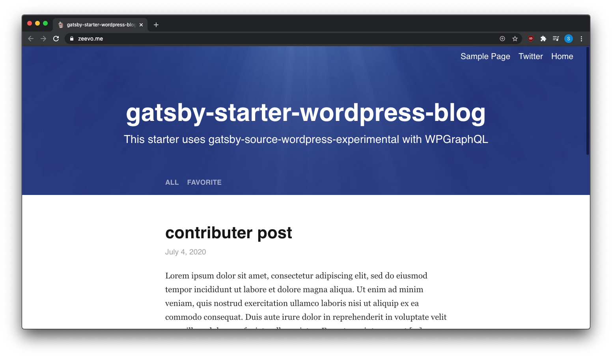

# Gatsby Starter Blog

Another blog starter with enough features to be production ready out of the box

## Setup

### Configure `env` and `gastby-config.js`

Make a `.env` file at the root of this project with your WPGraphQL endpoint and WP Admin endpoint:

Example:

```
# .env
WPGRAPHQL_URL=https://mywpsite.com/graphql
WP_ADMIN_URL=https//mywpsite.com/wp-login
```

## Features

- Easily have custom background images on a post by post basis by included a Wordpress Featured Image
- Source posts from Wordpress using WPGraphQL
- High performance
- Config first setup
- Extendable
- Sort by Category
- RSS generation

## 🚀 Quick start

1.  **Create a Gatsby site.**

    Use the Gatsby CLI to create a new site, specifying the blog starter.

    ```shell
    # create a new Gatsby site using the blog starter
    gatsby new my-blog-starter https://github.com/zeevosec/gatsby-starter-wordpress-blog
    ```

1.  **Start developing.**

    Navigate into your new site’s directory and start it up.

    ```shell
    cd my-blog-starter/
    gatsby develop
    ```

## 🧐 What's inside?

A quick look at the top-level files and directories you'll see in a Gatsby project.

    .
    ├── node_modules
    ├── src
    ├── static
    ├── .browserslistrc
    ├── .gitignore
    ├── .eslintrc
    ├── .gitattributes
    ├── .gitignore
    ├── .prettierrc
    ├── .travis.yml
    ├── gatsby-config.js
    ├── gatsby-node.js
    ├── LICENSE
    ├── package-lock.json
    ├── package.json
    ├── README.md
    └── yarn.lock

1.  **`/node_modules`**: This directory contains all of the modules of code that your project depends on (npm packages) are automatically installed.

2.  **`/src`**: This directory will contain all of the code related to what you will see on the front-end of your site (what you see in the browser) such as your site header or a page template. `src` is a convention for “source code”.

3.  **`/static`**: This directory will contain all of your static files that are used globally in the site. Like background images, or attachments.

4.  **`.browserslistrc`**: Specifies which browser and what version we want our site to target.

5.  **`.eslintrc`**: Eslint configuration, following mostly [Prettier](https://prettier.io/) defaults.

6.  **`.gitattributes`**: Defines git attributes for paths

7.  **`.gitignore`**: This file tells git which files it should not track / not maintain a version history for.

8.  **`.prettierrc`**: This is a configuration file for [Prettier](https://prettier.io/). Prettier is a tool to help keep the formatting of your code consistent.

9.  **`.travis.yml`**: A file used by Travis-CI to define actions or run tests and linting.

10. **`gatsby-config.js`**: This is the main configuration file for a Gatsby site. This is where you can specify information about your site (metadata) like the site title and description, which Gatsby plugins you’d like to include, etc. (Check out the [config docs](https://www.gatsbyjs.org/docs/gatsby-config/) for more detail).

11. **`gatsby-node.js`**: This file is where Gatsby expects to find any usage of the [Gatsby Node APIs](https://www.gatsbyjs.org/docs/node-apis/) (if any). These allow customization/extension of default Gatsby settings affecting pieces of the site build process.
12. **`LICENSE`**: This starter is licensed under the MIT license.

13. **`package-lock.json`** (See `package.json` below, first). This is an automatically generated file based on the exact versions of your npm dependencies that were installed for your project. Feel free to remove this if you are using Yarn. **(You won’t change this file directly).**

14. **`package.json`**: A manifest file for Node.js projects, which includes things like metadata (the project’s name, author, etc). This manifest is how npm knows which packages to install for your project.

15. **`README.md`**: This file! Edit me to make it yours!

16. **`yarn.lock`**: A file useful for the package manager Yarn (like package-lock.json). Feel free to remove this if you are using NPM. **(You won’t change this file directly).**
